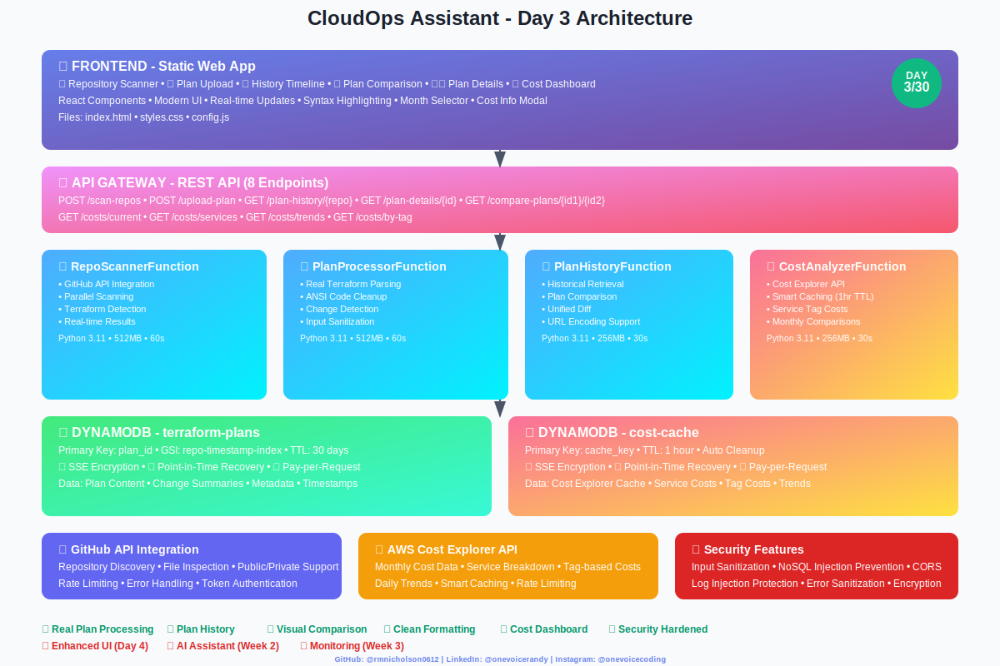

# CloudOps Assistant - Architecture Overview (Day 3)



## 🏗️ Current Infrastructure Architecture

```
┌─────────────────────────────────────────────────────────────────────────────────┐
│                              CLOUDOPS ASSISTANT                                 │
│                            Day 3 Architecture                                   │
└─────────────────────────────────────────────────────────────────────────────────┘

┌─────────────────────────────────────────────────────────────────────────────────┐
│                                 FRONTEND                                        │
├─────────────────────────────────────────────────────────────────────────────────┤
│  📱 Static Web App (Local Development)                                        │
│  ├── index.html - Main dashboard with tabbed navigation                        │
│  ├── styles.css - Modern UI with glassmorphism design                         │
│  ├── config.js - API endpoints and feature flags                              │
│  └── Features:                                                                │
│      ├── 🔍 Repository Scanner UI with real-time results                     │
│      ├── 📤 Plan Upload Modal with file validation                           │
│      ├── 📊 History Timeline View with metadata                              │
│      ├── 🔄 Plan Comparison Diff Viewer with syntax highlighting            │
│      ├── 👁️ Individual Plan Details Modal                                    │
│      └── 🎨 Clean Terraform Plan Formatting                                  │
└─────────────────────────────────────────────────────────────────────────────────┘
                                       │
                                   HTTPS/API
                                       │
┌─────────────────────────────────────────────────────────────────────────────────┐
│                              API GATEWAY                                        │
├─────────────────────────────────────────────────────────────────────────────────┤
│  🌐 REST API with CORS enabled                                                │
│  ├── POST /scan-repos - Repository scanning endpoint                          │
│  ├── POST /upload-plan - Plan processing endpoint                             │
│  ├── GET /plan-history/{repo} - History retrieval                             │
│  ├── GET /plan-details/{plan_id} - Individual plan view                       │
│  └── GET /compare-plans/{plan1}/{plan2} - Plan comparison                     │
└─────────────────────────────────────────────────────────────────────────────────┘
                                       │
                                   Invokes
                                       │
┌─────────────────────────────────────────────────────────────────────────────────┐
│                            LAMBDA FUNCTIONS                                     │
├─────────────────────────────────────────────────────────────────────────────────┤
│                                                                                 │
│  🔍 RepoScannerFunction                                                        │
│  ├── Handler: repo_scanner.lambda_handler                                     │
│  ├── Runtime: Python 3.11                                                    │
│  ├── Memory: 512MB, Timeout: 60s                                             │
│  └── Features:                                                                │
│      ├── GitHub API integration (users & orgs)                               │
│      ├── Parallel repository scanning                                         │
│      ├── Terraform file detection                                             │
│      └── Real-time drift simulation (no storage)                             │
│                                                                                 │
│  📋 PlanProcessorFunction                                                      │
│  ├── Handler: plan_processor.lambda_handler                                   │
│  ├── Runtime: Python 3.11                                                    │
│  ├── Memory: 512MB, Timeout: 60s                                             │
│  └── Features:                                                                │
│      ├── Real terraform plan parsing                                          │
│      ├── ANSI code cleanup & formatting                                       │
│      ├── Change detection algorithms                                          │
│      ├── Input sanitization & validation                                      │
│      └── Plan storage with metadata                                           │
│                                                                                 │
│  📊 PlanHistoryFunction (Day 2)                                               │
│  ├── Handler: plan_history.lambda_handler                                     │
│  ├── Runtime: Python 3.11                                                    │
│  ├── Memory: 256MB, Timeout: 30s                                             │
│  └── Features:                                                                │
│      ├── Historical plan retrieval with pagination                           │
│      ├── Plan comparison with unified diff                                    │
│      ├── Individual plan details view                                         │
│      ├── URL encoding/decoding support                                        │
│      └── Proper error handling & logging                                     │
│                                                                                 │
│  💰 CostAnalyzerFunction (Day 3)                                              │
│  ├── Handler: cost_analyzer.lambda_handler                                    │
│  ├── Runtime: Python 3.11                                                    │
│  ├── Memory: 256MB, Timeout: 30s                                             │
│  └── Features:                                                                │
│      ├── AWS Cost Explorer API integration                                    │
│      ├── Monthly cost tracking with historical data                          │
│      ├── Service-level cost breakdown                                         │
│      ├── Cost by custom service tags                                          │
│      ├── Smart caching with 1-hour TTL                                       │
│      └── Input validation & injection prevention                              │
│                                                                                 │
└─────────────────────────────────────────────────────────────────────────────────┘
                                       │
                                   Reads/Writes
                                       │
┌─────────────────────────────────────────────────────────────────────────────────┐
│                              DYNAMODB TABLES                                   │
├─────────────────────────────────────────────────────────────────────────────────┤
│                                                                                 │
│  📈 terraform-plans (Primary - Day 2)                                         │
│  ├── Partition Key: plan_id (repo_name#timestamp)                             │
│  ├── GSI: repo-timestamp-index                                                │
│  │   ├── Partition Key: repo_name                                             │
│  │   └── Sort Key: timestamp                                                  │
│  ├── TTL: 30 days                                                             │
│  ├── Encryption: SSE enabled                                                  │
│  ├── Backup: Point-in-time recovery                                           │
│  └── Data: Full plan content, change summaries, metadata                      │
│                                                                                 │
│  💰 cost-cache (Day 3)                                                        │
│  ├── Partition Key: cache_key                                                 │
│  ├── TTL: 1 hour (automatic cleanup)                                          │
│  ├── Encryption: SSE enabled                                                  │
│  ├── Backup: Point-in-time recovery                                           │
│  └── Data: Cached cost data from AWS Cost Explorer                            │
│                                                                                 │
└─────────────────────────────────────────────────────────────────────────────────┘

┌─────────────────────────────────────────────────────────────────────────────────┐
│                            EXTERNAL INTEGRATIONS                                │
├─────────────────────────────────────────────────────────────────────────────────┤
│  🐙 GitHub API                                                                │
│  ├── Repository discovery (users & orgs)                                      │
│  ├── File content inspection                                                  │
│  ├── Public & private repo support                                            │
│  └── Rate limiting & error handling                                           │
│                                                                                 │
│  💰 AWS Cost Explorer API (Day 3)                                             │
│  ├── Monthly cost data retrieval                                              │
│  ├── Service-level cost breakdown                                             │
│  ├── Cost by custom tags (Service tag)                                        │
│  ├── Daily cost trends (30-day history)                                       │
│  └── Smart caching to minimize API costs                                      │
└─────────────────────────────────────────────────────────────────────────────────┘

┌─────────────────────────────────────────────────────────────────────────────────┐
│                              SECURITY FEATURES                                 │
├─────────────────────────────────────────────────────────────────────────────────┤
│  🔒 Input Sanitization                                                        │
│  ├── SQL/NoSQL injection prevention                                           │
│  ├── Log injection protection                                                 │
│  ├── XSS prevention                                                           │
│  └── Input size validation                                                    │
│                                                                                 │
│  🛡️ Infrastructure Security                                                   │
│  ├── DynamoDB encryption at rest                                              │
│  ├── Point-in-time recovery enabled                                           │
│  ├── IAM least privilege policies                                             │
│  ├── CORS properly configured                                                 │
│  ├── Error message sanitization                                               │
│  └── Proper logging without data exposure                                     │
│                                                                                 │
│  💰 Cost Optimization                                                         │
│  ├── Pay-per-request DynamoDB billing                                         │
│  ├── Lambda cold start optimization                                           │
│  ├── TTL-based automatic cleanup                                              │
│  └── Efficient query patterns with GSI                                       │
└─────────────────────────────────────────────────────────────────────────────────┘

## 🚀 Day 3 Achievements

### ✅ Completed Features
- **Real Terraform Plan Processing**: Upload and analyze actual terraform plans
- **Plan History Tracking**: Store and retrieve historical terraform plans
- **Visual Plan Comparison**: Side-by-side diff viewer with syntax highlighting
- **Clean Plan Display**: Formatted terraform output with color coding
- **Individual Plan Details**: View complete plan content with metadata
- **AWS Cost Dashboard**: Real-time cost tracking with Cost Explorer integration
- **Monthly Cost Analysis**: Historical cost data for last 12 months
- **Service Cost Breakdown**: See which AWS services cost the most
- **Cost by Service Tags**: Track spending by custom "Service" tags
- **Cost Trends**: 30-day daily spending analysis
- **Smart Cost Caching**: 1-hour TTL to minimize API calls
- **Cost Info Modal**: Comprehensive documentation for cost features

### 🔧 Technical Improvements
- **ANSI Code Cleanup**: Remove terminal escape sequences from plan output
- **Performance Optimization**: Lazy loading and efficient queries
- **Code Quality**: Removed duplicate functions and improved maintainability
- **Logging**: Structured logging with context for debugging

### 📊 Current Metrics
- **4 Lambda Functions**: Repo scanner, plan processor, plan history, cost analyzer
- **2 DynamoDB Tables**: terraform-plans, cost-cache
- **8 API Endpoints**: Scan, upload, history, compare, details, costs (current/services/trends/by-tag)
- **Security Score**: High (input sanitization, encryption, proper CORS, injection prevention)

## 🎯 Next Steps (Day 4+)
- Enhanced UI with React components
- Budget alerts and thresholds
- JWT authentication with Cognito
- Scheduled drift monitoring
- AI-powered plan analysis

## 💡 Key Design Decisions

### Why Serverless?
- **Cost Efficiency**: Pay only for actual usage
- **Auto Scaling**: Handles traffic spikes automatically
- **No Infrastructure Management**: Focus on features, not servers
- **High Availability**: Built-in redundancy and fault tolerance

### Why DynamoDB?
- **Performance**: Single-digit millisecond latency
- **Scalability**: Handles any workload size
- **Cost Effective**: Pay-per-request pricing
- **Serverless Native**: Perfect fit for Lambda functions

### Why Single Table Design?
- **Simplified Architecture**: One table to manage
- **Cost Optimization**: Reduced storage and query costs
- **Performance**: Efficient access patterns with GSI
- **Maintenance**: Easier backup and monitoring

## 🔍 Data Flow

### Plan Upload Flow
1. User uploads terraform plan file via frontend
2. Frontend sends plan content to `/upload-plan` endpoint
3. PlanProcessorFunction parses and analyzes plan
4. Plan stored in terraform-plans table with metadata
5. Response returned with drift analysis results

### Plan History Flow
1. User requests history for specific repository
2. PlanHistoryFunction queries GSI by repo_name
3. Results sorted by timestamp (newest first)
4. Frontend displays timeline with plan metadata

### Plan Comparison Flow
1. User selects two plans to compare
2. PlanHistoryFunction retrieves both plans
3. Unified diff generated using Python difflib
4. Frontend displays side-by-side comparison with highlighting
